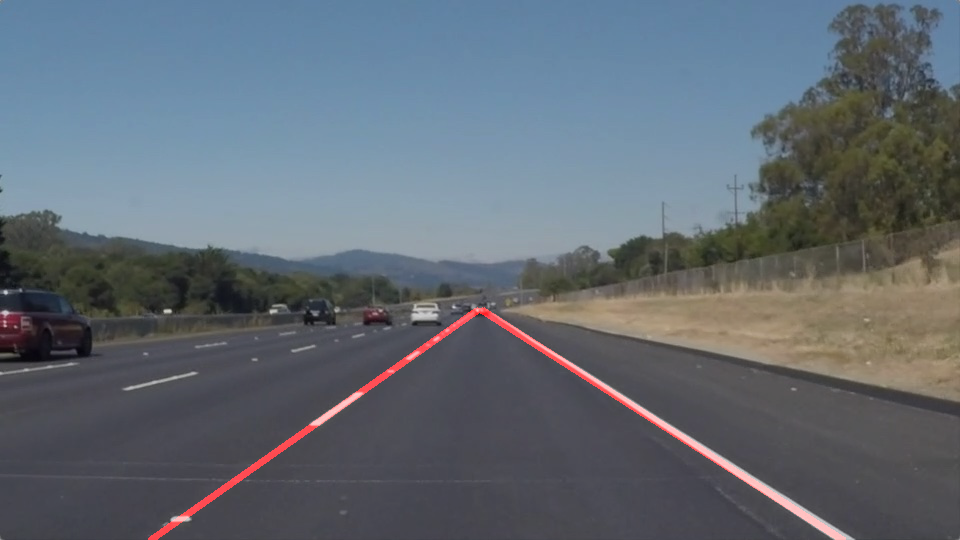

# **Finding Lane Lines on the Road** 

## The aim of this project is to use raw images and video samples provided and apply algorithms introduced in lectures to mark lane lines.

---

**Finding Lane Lines on the Road**

As mentioned earlier the goals / steps of this project are the following:
* Make a pipeline that finds lane lines on the road
* Use the pipeline effective to find lane lines on a video
* Reflect on your work in a written report

---

### Project Reflection

### 1. Working on the pipeline.

Working on the pipeline was fairly linearly based on the lecture topics that preceded this project. A few of my other colleagues are also taking this degree program and hence we do collaborate at times to discuss some strategies that might help improve the output of these projects.

I introduce a new function - IdentifyLaneMarkings(). Detailed comments for this function are provided in the notebook. The pipeline consists of the following steps:

1. Initialize all the parameteres required by the function
2. Convert input image to gray scale
3. Apply Gaussian blur to the gray scale image
4. Apply Canny edge detection to the Gaussian Blur Image
5. Perfrom Hough transform on the edge detected image
6. Apply region of interest
7. Use weighted_img to apply mask on original image

|  |  |
|:---:|:---:|
| ./test_images/solidWhiteRight.jpg | ./test_images_output/solidWhiteRight.jpg |

 

### 2. Working on videos and updating draw_lines().

We now get asked to update draw_lines() so that we can apply our pipeline to successfully identify lane lines on videos.
The crux of the problem here is to idetify the side of the lane line that you want to mark, viz. identify if a lane line marker is left lane marker of a right lane marker.

To achive this, we can do the following:
1. Iterate through every x and y cordinates of a line from a list of lines.
2. Find slope of the current line at hand from its x and y cordinates.
3. Once we know if the lane is a right or a left lane from its slope, we append the cordinates to its respective list.
4. After having iterated through all lines, we find the true cordinates using the equation of a line *y = mx + c*
5. Having the true cordinates, we use cv2.line to draw a line at the location of our calculated X and Y cordinates.

### 3. Identifying potential shortcomings and listing possible improvements for the pipeline

#### Shortcomings
* Currently as seen from the video ouput, lane lines cut during certain portions of the video. In a real world scenario this would be unacceptable.
* During the course of writting the code for this project, it becomes very evident that the CV2 parameters used with CANNY and HOUGH really make a huge impact on the nature of line and accuracy of the detection.
* The pipeline is implemented accurately towards the problem statement at hand, however the out is not perfectly as expected.

#### Possible Improvements
* More fine tuning of the CANNY and HOUGH parameters can be done so that the lane lines are detected with more accuracy and solidness during the course of the video.