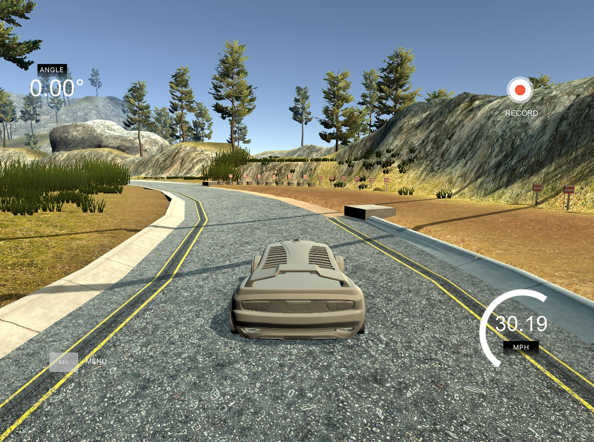

# **Behavioral Cloning** 

Click on the screenshot below to navigate to my project video. 

[](https://youtu.be/9_CezeG1qGc "Project Output")

---

## **Behavioral Cloning Project**

The goals / steps of this project are the following:
* Use the simulator to collect data of good driving behavior
* Build, a convolution neural network in Keras that predicts steering angles from images
* Train and validate the model with a training and validation set
* Test that the model successfully drives around track one without leaving the road
* Summarize the results with a written report


[//]: # (Image References)

[image1]: ./Outputs/ModelSummary.JPG "Model Summary"
[image2]: ./Outputs/CroppedImage.JPG "Cropped Image"
[image3]: ./Outputs/FlippedImage.JPG "Flipped Image"
[image4]: ./Outputs/ModelTrainingSummary.JPG "Model Training Summary"
[image5]: ./Outputs/ModelMSELoss.JPG "Model MSE Loss"

## Rubric Points
#### Here I will consider the [rubric points](https://review.udacity.com/#!/rubrics/432/view) individually and describe how I addressed each point in my implementation.  

---
### Files Submitted & Code Quality

#### 1. Submission includes all required files and can be used to run the simulator in autonomous mode

My project includes the following files:
* model.py containing the script to create and train the model
* drive.py for driving the car in autonomous mode
* model.h5 containing a trained convolution neural network 
* Project_writeup.md summarizing the results
* video.mp4 showing the result

#### 2. Submission includes functional code
Using the Udacity provided simulator and my drive.py file, the car can be driven autonomously around the track by executing 
```sh
python drive.py model.h5
```

#### 3. Submission code is usable and readable

The model.py file contains the code for training and saving the convolution neural network. The file shows the pipeline I used for training and validating the model, and it contains comments to explain how the code works.

### Model Architecture and Training Strategy

#### 1. An appropriate model architecture has been employed

My model implementation is based off of [End-to-end learning for Self-driving cars paper](http://images.nvidia.com/content/tegra/automotive/images/2016/solutions/pdf/end-to-end-dl-using-px.pdf) by NVIDIA. Along with this I have had discussions with my colleagues also taking this course and study group people working on this course. The model uses a normalizing layer before the first layer - implmented using Lambda - as shown in lecture videos and also a Flatten layer after all CONV2D layers.

The model consists of the following layer:

Layer | Filters | Kernel size | Stride | Activation | # Neurons
--- | --- | --- | --- | --- | ---
1 | 24 | 5x5 | 2x2 | RELU | ---
2 | 36 | 5x5 | 2x2 | RELU | ---
3 | 48 | 5x5 | 2x2 | RELU | ---
4 | 64 | 3x3 | 1x1 | RELU | ---
5 | 64 | 3x3 | 1x1 | RELU | ---
6 | --- | --- | --- | --- | 1164
7 | --- | --- | --- | --- | 100
8 | --- | --- | --- | --- | 50
9 | --- | --- | --- | --- | 10
10 | --- | --- | --- | --- | 1

More details can also been seen in the **Final Model Architecture** section below.

#### 2. Attempts to reduce overfitting in the model

The model contains dropout layers in order to reduce overfitting (model.py initialized on line 13 and implmented on line 123 and 125). From this we can see that I used a dropout probability of 0.5.
The model was tested by running it through the simulator and ensuring that the vehicle could stay on the track.

#### 3. Model parameter tuning

The model used an adam optimizer, so the learning rate was not tuned manually (model.py line 133).

#### 4. Appropriate training data

Training data was chosen to keep the vehicle driving on the road. The following sets of training data was used for this project:
1. All given training data from Udacity.
2. Left, Center, Right images of 2 laps of manual driving in forward direction.
3. Left, Center, Right images of 2 laps of manual driving in reverse direction.

Along with this I applied a correction of 0.2 on left and right images, using suggestions from lecture videos. For details about how I created the training data, see the next section. 

### Model Architecture and Training Strategy

#### 1. Solution Design Approach

The overall strategy for deriving a model architecture is based of lecture videos and lecture notes. Here we make use of the NVIDIA model. Our data is split 80-20% for training and validation.

I started off on a very small model as shown in the lecture videos, which contained only 1 CONV2d layer without any lambda and dropouts. The performance on this was very poor and hence got to the eventual NVIDIA design in sort of an incremental manner. Once I found there was some bias with a few images, I decided to crop and flip some of the images as suggested in the lecture videos. Cropping was done along [50:137] the y-axis and this cropped image was resized to fit NVIDIA input size of (66, 200)

Based off of discussions with my colleagues also taking this course and local discussion groups, I used suggestions that came there along with lecture project suggestions. I drove 2 laps in both forward and reverse direction. To compensate for the recovery data, during the second lap of both drives, I explicity made sharp maneuvers during the sharp turn sections of the track. I started with 1 epoch and ended up with 5 as more that 5 made the validation loss rise high. A slight modification was also made to the *drive.py* code to get it to work with the trained model.

By doing all this the car was able to steer autonomously in the simulator. While those 2 sharp turns might seem intimidating, the car safely stays in the lane and does not wander off. Below in future discussion we talk more about enhancements and current issues.

#### 2. Final Model Architecture

The final model architecture (model.py lines 113-128) consisted of a convolution neural network which has been discussed above. A summary of the model can be seen in the image below.

Here is a visualization of the architecture (note: visualizing the architecture is optional according to the project rubric)

![alt text][image1]

#### 3. Creation of the Training Set & Training Process

As mentioned, the training set consists of the following:
1. Give training data.
2. Forward driving data - I drove 2 laps around the track in the forward direction.
3. Reverse driving data - I drove 2 laps around the track in the reverse direction.

The driving around the lap was smooth, driving mostly at the center. During the second lap of the driving I would try to make sharp inward turns to collect data for **recovery**.

For the data used - images - I cropped and resized the images and also flipped some of the images so that there is a balance in the data. Below are sample images for the same:

Cropped Image | Flipped Image
--- | --- 
![alt text][image2] | ![alt text][image3]

We have already spoken about the data splitting done for training. Below are sample of images for the losses and training process progress for training and validation sets on the collected data:

Model Training Summary | Model MSE Loss
--- | --- 
![alt text][image4] | ![alt text][image5]

### Further discussions

Here we can see that we were able to get the behavior cloned and have the car drive around the track with minimal data. There are 2 bits in the autonomous driving mode which can be significantly improved.
1. The sharp left turn after the bridge.
2. The sharp right turn following previous mentioned turn.
Both these turns are navigated by the car currently, however if we add **recover data** to the training set then we can keep the car significantly towards the center.
Additionally, there might be other methods and model enhancements that can be performed to improve the performance of the cloned behavior.