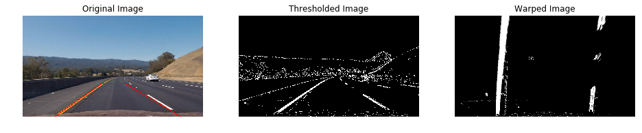
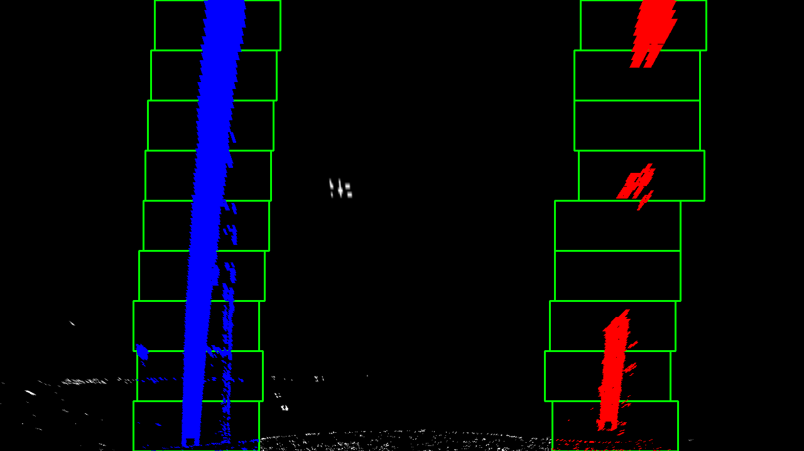
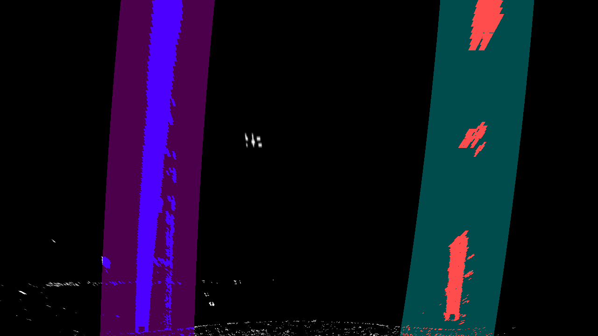
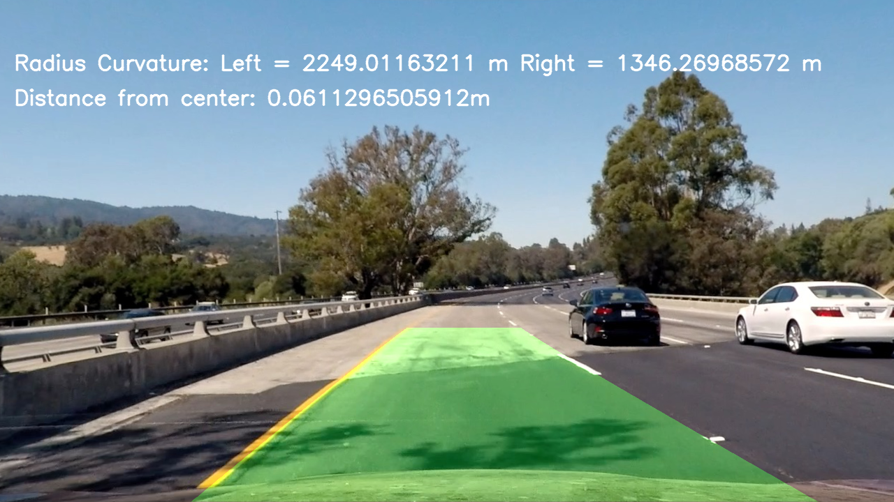

# **Advanced Lane Finding Project**
---
The goals / steps of this project are the following:

* Compute the camera calibration matrix and distortion coefficients given a set of chessboard images.
* Apply a distortion correction to raw images.
* Use color transforms, gradients, etc., to create a thresholded binary image.
* Apply a perspective transform to rectify binary image ("birds-eye view").
* Detect lane pixels and fit to find the lane boundary.
* Determine the curvature of the lane and vehicle position with respect to center.
* Warp the detected lane boundaries back onto the original image.
* Output visual display of the lane boundaries and numerical estimation of lane curvature and vehicle position.

[//]: # (Image References)

[image1]: ./output_images/output.png "Output"

## [Rubric](https://review.udacity.com/#!/rubrics/571/view) Points

### Here I will consider the rubric points individually and describe how I addressed each point in my implementation.  

---

### Writeup / README

This writeup talks about the the Advanced Lane Lines project. A few of my other colleagues are also taking this degree program and hence we do collaborate at times to discuss some strategies that might help improve the output of these projects. The implementational details of items mentioned here can be in this [notebook](https://github.com/metawala/SDCarNDTerm1/blob/master/P4_CarND_Advanced_Lane_Lines/Advanced_Lane_Lines.ipynb)

### Camera Calibration

#### 1. Briefly state how we computed the camera matrix and distortion coefficients. Provide an example of a distortion corrected calibration image.

The project starts with camera calibration and distortion correction on chessboard images. The implementation details of this is in the *"Find Chess Board corner"* section and *Create helper functions for camera calibration and undistorting or image* section of the notebook. We introduce the following helper functions:
1. calibrateCamera()
2. undistortImage()
3. getRGBImage()

To detect chess board corners, we follow project videos preceeding this particular project. The steps taken:
1. Import the image and define the number of object points. (9, 6) for our case.
2. Convert the image to gray scale.
3. Use findChessboardCorners() method from CV2 library.
4. If the above step found a corner then we use drawChessboardCorners() method from CV2 library and plot the detected corners.

 [](./output_images/corners_chessboard_output.png "chess image")

To undistort chess board test image and calibrate the camera, we follow project videos preceeding this particular project. The steps taken:
1. We create a calibrateCamera() function to get the cameraMatrix, distCoeff, rotationalVec, transVec and corners.
2. Using this we use the undistort() method from CV2 library.
3. The calibrateCamera() method internally makes use of the calibrateCamera() method from CV2 library.

 [](./camera_cal/calibration10.jpg "Test chess image") | [](./output_images/undistorted_chessboard_output.png "Undistorted image") 
 --- | --- 
  Test chess image | Undistorted image 

### Pipeline (single images)

The main idea during for this pipeline is:
1. Undistort, threshold and transform an image
2. Check if any points to do exist then follow lecture note videos:
  1. Get Histogram of lower half of the image
  2. Calculate midpoint and peaks
  3. Initialize variables
  4. Iterate through each window from all windows - identify window boundaries, nonzero pixels in x and y, concatenate array of indices and fit a second order polynomial.
3. Generate x and y values for plotting
4. Create an image to draw the lines on
5. Recast the x and y points into usable format for cv2.fillPoly()
6. Warp the blank back to original image space
7. Fit new polynomials to x,y in world space and calculate the radius of curvature
8. Define the font to be used and overlay text on the image

#### 1. Provide an example of a distortion-corrected image.

Above described distortion correction technique and camera calibration is then applied to the test images.

 [](./test_images/test2.jpg "Test image") | [](./output_images/undistorted_test_output.png "Undistorted image") 
 --- | --- 
  Test image | Undistorted image

#### 2. Describe how (and identify where in your code) you used color transforms, gradients or other methods to create a thresholded binary image.  Provide an example of a binary image result.

Currently for this part of the implementation we make use of the thresholding techniques shown in the lectures. We use magnitude, directional and color thresholding. Later in the project we revise the thresholding, but for this part we follow:
1. Undistort the image
2. Convert to Grayscale
3. Perform Abs Sobel threshold on X and Y
4. Perform a Magnitude threshold
5. Perform a Directioal threshold
6. Perfom a L and S threshold
7. Combine applied threshold

[](./output_images/thresholdedImage.png "Thresholding image")

#### 3. Describe how (and identify where in your code) you performed a perspective transform and provide an example of a transformed image.

Section of **View Perspective and Wraped transform on test image** in the notebook represents how we perform the tranforms. After applying Gradiant and Color thresholding on a test image. We apply perspective transform on the test image. Once we have applied perspective transform, we choose a "Region of interest" and warp the image to get a "Bird's eye view" of the image. I chose the hardcode the source and destination points in the following manner:

```python
# Grid for required region of interest on actual image
bottomLeft  = [215, 730]
topLeft     = [560, 485]
topRight    = [730, 485]
bottomRight = [1140, 730]
# Create a SRC Matrix
srcPoints = np.float32([bottomLeft, bottomRight, topRight, topLeft])
# Grid for required region to go on the warped and transformed image
bottomLeft  = [300, 730]
topLeft     = [320, 0]
topRight    = [930, 0]
bottomRight = [950, 730]
# Create a Dest Matrix
dstPoints = np.float32([bottomLeft, bottomRight, topRight, topLeft])
```

This resulted in the following source and destination points:

| Source        | Destination   | 
|:-------------:|:-------------:| 
| 215, 730      | 300, 730      | 
| 560, 485      | 320, 0        |
| 730, 485      | 930, 0        |
|1140, 730      | 950, 730      |

Following image shows the result of the above mentioned implemenational details.

[](./output_images/transformingThresholdedImage.png "Transforming Thresholded image")

#### 4. Describe how (and identify where in your code) you identified lane-line pixels and fit their positions with a polynomial?

The commented section is our pipeline shows the final overlaying of lane-line pixles and sliding window techniques. This is present in lines 144-183. Though this is where we use the overlaying some of the calculation required is done right before this section of the code.

Once we apply the steps above we get the following:

 [](./output_images/slidingWindow_laneLines.png "Sliding window laneLines") | [](./output_images/laneLinesPixel.png "Lane Lines Pixel") 
 --- | --- 
  Sliding window laneLines | Lane Lines Pixel

#### 5. Describe how (and identify where in your code) you calculated the radius of curvature of the lane and the position of the vehicle with respect to center.

Once we wrap the blank back back to original image space using inverse perspective matrix and combine the result in the **Pipeline()** method. We calculate the radius of curvature of the lane. I use the same methods that are taught in lecture notes. This is done from lines 208-225.

#### 6. Provide an example image of your result plotted back down onto the road such that the lane area is identified clearly.

Here is an example of my result on a test image:

![alt text][image1]

---

### Pipeline (video)

#### 1. Provide a link to your final video output.  Your pipeline should perform reasonably well on the entire project video (wobbly lines are ok but no catastrophic failures that would cause the car to drive off the road!).

Click on the screenshot below to navigate to my project video. [](https://youtu.be/m5R33ddrpgY "Project Output")

---

### Discussion

#### 1. Briefly discuss any problems / issues you faced in your implementation of this project.  Where will your pipeline likely fail?  What could you do to make it more robust?

1. I started off with a basic crude model and using the code presented in lectures exactly as is. Once I had all the code I started playing with the mask values and types to generate a decent thresholded image.
2. To verify if lanes were detected correctly I used the histogram method on my warped image. Once this was a success, I decided to go ahead with the pipeline implementation.
3. I followed exact steps mentioned in lecture notes. Along with a few discussions with my colleages, I updated the code to iteratively improve to produce what I have submitted here.
4. The current implementation is sort of hardcoded to fit this particular test images and videos. It would be interesting to test this implementation with other situations.
