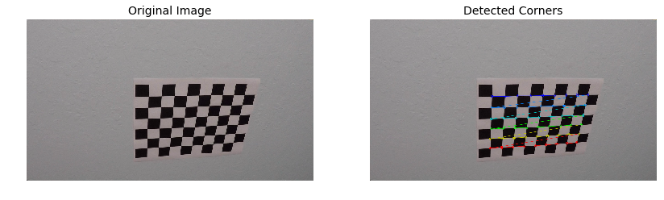
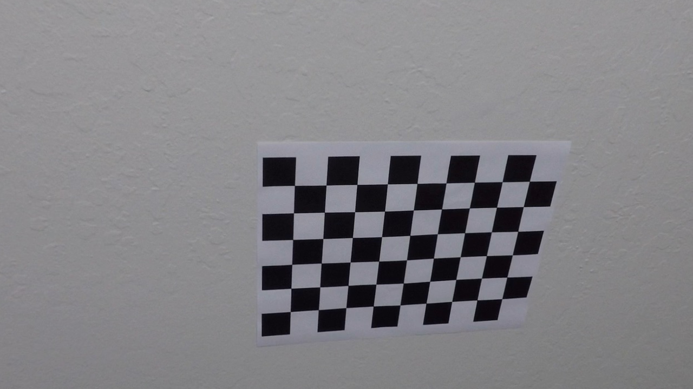
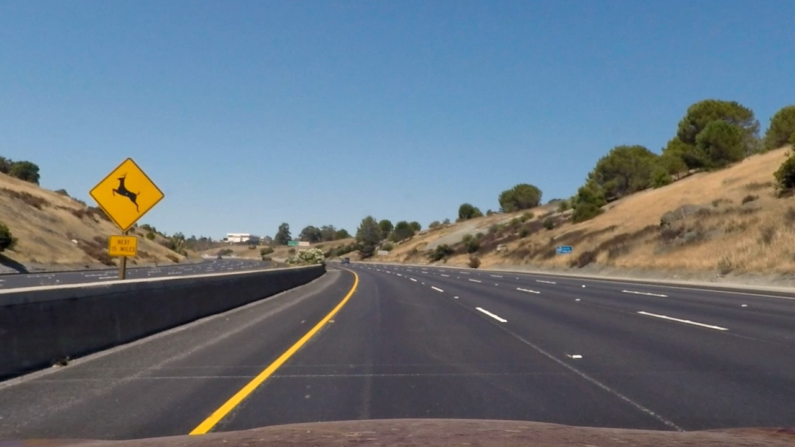

# **Advanced Lane Finding Project**
---
The goals / steps of this project are the following:

* Compute the camera calibration matrix and distortion coefficients given a set of chessboard images.
* Apply a distortion correction to raw images.
* Use color transforms, gradients, etc., to create a thresholded binary image.
* Apply a perspective transform to rectify binary image ("birds-eye view").
* Detect lane pixels and fit to find the lane boundary.
* Determine the curvature of the lane and vehicle position with respect to center.
* Warp the detected lane boundaries back onto the original image.
* Output visual display of the lane boundaries and numerical estimation of lane curvature and vehicle position.

[//]: # (Image References)

[image2]: ./test_images/test1.jpg "Road Transformed"
[image3]: ./examples/binary_combo_example.jpg "Binary Example"
[image4]: ./examples/warped_straight_lines.jpg "Warp Example"
[image5]: ./examples/color_fit_lines.jpg "Fit Visual"
[image6]: ./examples/example_output.jpg "Output"
[video1]: ./project_video.mp4 "Video"

## [Rubric](https://review.udacity.com/#!/rubrics/571/view) Points

### Here I will consider the rubric points individually and describe how I addressed each point in my implementation.  

---

### Writeup / README

This writeup talks about the the Advanced Lane Lines project. A few of my other colleagues are also taking this degree program and hence we do collaborate at times to discuss some strategies that might help improve the output of these projects. The implementational details of items mentioned here can be in this [notebook](https://github.com/metawala/SDCarNDTerm1/blob/master/P4_CarND_Advanced_Lane_Lines/Advanced_Lane_Lines.ipynb)

### Camera Calibration

#### 1. Briefly state how we computed the camera matrix and distortion coefficients. Provide an example of a distortion corrected calibration image.

The project starts with camera calibration and distortion correction on chessboard images. The implementation details of this is in the *"Find Chess Board corner"* section and *Create helper functions for camera calibration and undistorting or image* section of the notebook. We introduce the following helper functions:
1. calibrateCamera()
2. undistortImage()
3. getRGBImage()

To detect chess board corners, we follow project videos preceeding this particular project. The steps taken:
1. Import the image and define the number of object points. (9, 6) for our case.
2. Convert the image to gray scale.
3. Use findChessboardCorners() method from CV2 library.
4. If the above step found a corner then we use drawChessboardCorners() method from CV2 library and plot the detected corners.

 [](./output_images/corners_chessboard_output.png "chess image")

To undistort chess board test image and calibrate the camera, we follow project videos preceeding this particular project. The steps taken:
1. We create a calibrateCamera() function to get the cameraMatrix, distCoeff, rotationalVec, transVec and corners.
2. Using this we use the undistort() method from CV2 library.
3. The calibrateCamera() method internally makes use of the calibrateCamera() method from CV2 library.

 [](./camera_cal/calibration10.jpg "Test chess image") | [](./output_images/undistorted_chessboard_output.png "Undistorted image") 
 --- | --- 
  Test chess image | Undistorted image 

### Pipeline (single images)

#### 1. Provide an example of a distortion-corrected image.

Above described distortion correction technique and camera calibration is then applied to the test images.

An example of this implementation:
 [](./test_images/test2.jpg "Test image") | [](./output_images/undistorted_test_output.png "Undistorted image") 
 --- | --- 
 Test image | Undistorted image 

#### 2. Describe how (and identify where in your code) you used color transforms, gradients or other methods to create a thresholded binary image.  Provide an example of a binary image result.

I used a combination of color and gradient thresholds to generate a binary image (thresholding steps at lines # through # in `another_file.py`).  Here's an example of my output for this step.  (note: this is not actually from one of the test images)

![alt text][image3]

#### 3. Describe how (and identify where in your code) you performed a perspective transform and provide an example of a transformed image.

The code for my perspective transform includes a function called `warper()`, which appears in lines 1 through 8 in the file `example.py` (output_images/examples/example.py) (or, for example, in the 3rd code cell of the IPython notebook).  The `warper()` function takes as inputs an image (`img`), as well as source (`src`) and destination (`dst`) points.  I chose the hardcode the source and destination points in the following manner:

```python
src = np.float32(
    [[(img_size[0] / 2) - 55, img_size[1] / 2 + 100],
    [((img_size[0] / 6) - 10), img_size[1]],
    [(img_size[0] * 5 / 6) + 60, img_size[1]],
    [(img_size[0] / 2 + 55), img_size[1] / 2 + 100]])
dst = np.float32(
    [[(img_size[0] / 4), 0],
    [(img_size[0] / 4), img_size[1]],
    [(img_size[0] * 3 / 4), img_size[1]],
    [(img_size[0] * 3 / 4), 0]])
```

This resulted in the following source and destination points:

| Source        | Destination   | 
|:-------------:|:-------------:| 
| 585, 460      | 320, 0        | 
| 203, 720      | 320, 720      |
| 1127, 720     | 960, 720      |
| 695, 460      | 960, 0        |

I verified that my perspective transform was working as expected by drawing the `src` and `dst` points onto a test image and its warped counterpart to verify that the lines appear parallel in the warped image.

![alt text][image4]

#### 4. Describe how (and identify where in your code) you identified lane-line pixels and fit their positions with a polynomial?

Then I did some other stuff and fit my lane lines with a 2nd order polynomial kinda like this:

![alt text][image5]

#### 5. Describe how (and identify where in your code) you calculated the radius of curvature of the lane and the position of the vehicle with respect to center.

I did this in lines # through # in my code in `my_other_file.py`

#### 6. Provide an example image of your result plotted back down onto the road such that the lane area is identified clearly.

I implemented this step in lines # through # in my code in `yet_another_file.py` in the function `map_lane()`.  Here is an example of my result on a test image:

![alt text][image6]

---

### Pipeline (video)

#### 1. Provide a link to your final video output.  Your pipeline should perform reasonably well on the entire project video (wobbly lines are ok but no catastrophic failures that would cause the car to drive off the road!).

Here's a [link to my video result](./project_video.mp4)

---

### Discussion

#### 1. Briefly discuss any problems / issues you faced in your implementation of this project.  Where will your pipeline likely fail?  What could you do to make it more robust?

Here I'll talk about the approach I took, what techniques I used, what worked and why, where the pipeline might fail and how I might improve it if I were going to pursue this project further.  
