# **Vehicle Detection Project**

---

The goals / steps of this project are the following:

* Perform a Histogram of Oriented Gradients (HOG) feature extraction on a labeled training set of images and train a classifier Linear SVM classifier
* Optionally, you can also apply a color transform and append binned color features, as well as histograms of color, to your HOG feature vector. 
* Note: for those first two steps don't forget to normalize your features and randomize a selection for training and testing.
* Implement a sliding-window technique and use your trained classifier to search for vehicles in images.
* Run your pipeline on a video stream (start with the test_video.mp4 and later implement on full project_video.mp4) and create a heat map of recurring detections frame by frame to reject outliers and follow detected vehicles.
* Estimate a bounding box for vehicles detected.

[//]: # (Image References)
[image1]: ./output_images/SpatialFeatures.png
[image2]: ./output_images/ColorHists.png

## [Rubric](https://review.udacity.com/#!/rubrics/513/view) Points
### Here I will consider the rubric points individually and describe how I addressed each point in my implementation.  

---
## Writeup / README

#### Below is a writeup on the implementation for the goals of this project, in detail. A few of my other colleagues are also taking this degree program and hence we do collaborate at times to discuss some strategies that might help improve the output of these projects. The implementational details of items mentioned here can be in this **[notebook](https://github.com/metawala/SDCarNDTerm1/tree/master/P5_Vehicle-Detection/Vehicle_Detection.ipynb)**

The projects works along the lines of what is provided in lecture videos. We follows steps taught in lectures and use the data from the provided dataset.
Steps followed are:
1. Perform spatial binning of colors
2. Perform data exploration. See how many cars and non-cars images are present in the dataset. What is the size of the image and so on.
3. Implement histogram of oriented gradients (HOG) features.
4. Combine and normalize features. We will now create a consolidated version of all those functions and create an "Extract Features" function to combine and normalize all the features, as shown in the lecture
5. Perfrom classification of cars vs non-cars.
6. Sliding window.
7. Find cars for the windows created.
8. Create a pipeline.

## Histogram of Oriented Gradients (HOG)

### 1. Explain how (and identify where in your code) you extracted HOG features from the training images.

The code for this step is contained in Data Exploration and HOG features section of the notebook.  

I started by reading in all the `vehicle` and `non-vehicle` images.  Here is an example of one of each of the `vehicle` and `non-vehicle` classes:

[](./output_images/carImage.png "Car") | [](./output_images/notCarImage.png "Not a car") 
 --- | --- 
  Car | Not a car

I then explored different color spaces and finally decided to use *YCrCb*. This was used throughout lecture project videos too. I also performed spatial binning and Color histograms on the test image. A sample of which looks like:

![alt text][image1]

The Color Histograms for the same looks like:

![alt text][image2]

The **getHogFeatures()** function in the *HOG Features* section generates the HOG of an image. I choose an image at random for this, as shown in the lecture videos. Here is an example using HOG parameters of `orientations=9`, `pixels_per_cell=(8, 8)` and `cells_per_block=(2, 2)`:

[](./output_images/hogCarImage.png "Car") | [](./output_images/hogFeatures.png "HOG car") 
 --- | --- 
  Car | HOG car

### 2. Explain how you settled on your final choice of HOG parameters.

I tried various combinations of parameters and...

### 3. Describe how (and identify where in your code) you trained a classifier using your selected HOG features (and color features if you used them).

Section **Classification of Cars vs Non-Cars** is the implmentation for a linear SVC to create a classifier to classify car vs non-car data. We use *extract_features* which internally makes use of color hist, spatial bins and HOG features.
To combine the features we normalize using the *StandardScaler()* method. The dataset is split into train-test with 80-20 breakout.

Following are the specifications we used during training:

```python
color_space    = 'YCrCb'     # Can be RGB, HSV, LUV, HLS, YUV, YCrCb
orient         = 9           # HOG orientations
pix_per_cell   = 8           # HOG pixels per cell
cell_per_block = 2           # HOG cells per block
hog_channel    = 'ALL'       # Can be 0, 1, 2, or "ALL"
spatial_size   = (32, 32)    # Spatial binning dimensions
hist_bins      = 64          # Number of histogram bins
spatial_feat   = True        # Spatial features on or off
hist_feat      = True        # Histogram features on or off
hog_feat       = True        # HOG features on or off
y_start_stop   = [None, None]  # Min and max in y to search in slide_window()
```

Following is the output of the trained classifier:

```python
1. Using 9 orientations, 8 pixels per cell and 2 cells per block
2. Feature vector Length: 8556
3. 24.67 Seconds to train the SVC ...
4. Test Accuracy of SVC: 0.9918
```

## Sliding Window Search

### 1. Describe how (and identify where in your code) you implemented a sliding window search.  How did you decide what scales to search and how much to overlap windows?

Sliding window is implemented in the *Sliding Window* section of the notebook. This function plots a rectangle at each window position. Our goal here is to write a function that takes in an image, start and stop positions in both x and y (imagine a bounding box for the entire search region), window size (x and y dimensions), and overlap fraction (also for both x and y). Our function should return a list of bounding boxes for the search windows, which will then be passed to draw draw_boxes() function. Once we do this, the *Find_cars* section implements this technique for live car test images. The find_cars only has to extract hog features once and then can be sub-sampled to get all of its overlaying windows. Each window is defined by a scaling factor where a scale of 1 would result in a window that's 8 x 8 cells then the overlap of each window is in terms of the cell distance. This means that a cells_per_step = 2 would result in a search window overlap of 75%.

Here we use the following limits and scale:

```python
ystart = 350
ystop  = 700
scale  = 1.5
```

The sliding window technique applied with **find_cars()** produces the following output on a test image:

[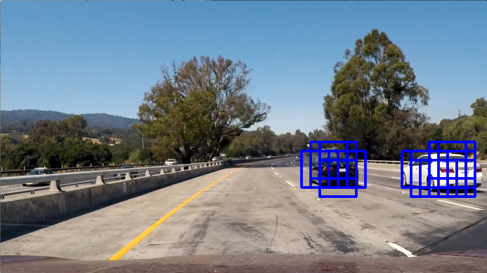](./output_images/find_cars_test1.png "SlidingWindowTest") | [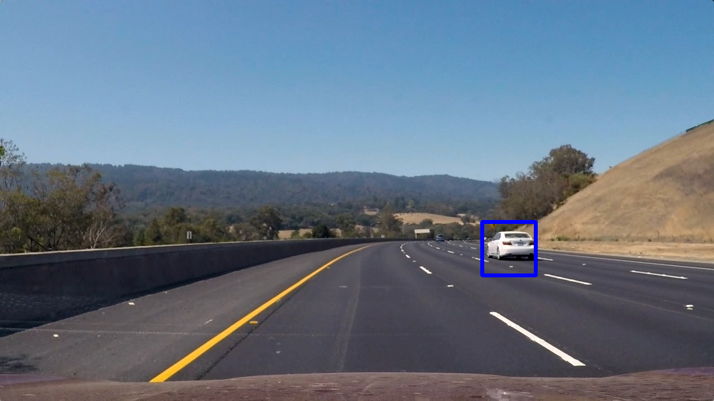](./output_images/find_cars_test2.png "SlidingWindowTest")
--- | ---
[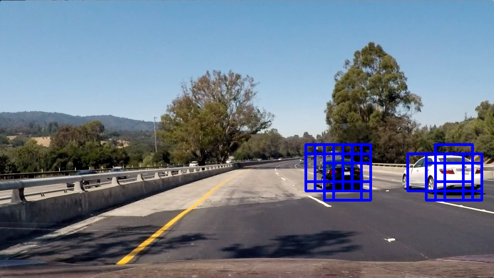](./output_images/find_cars_test3.png "SlidingWindowTest") | [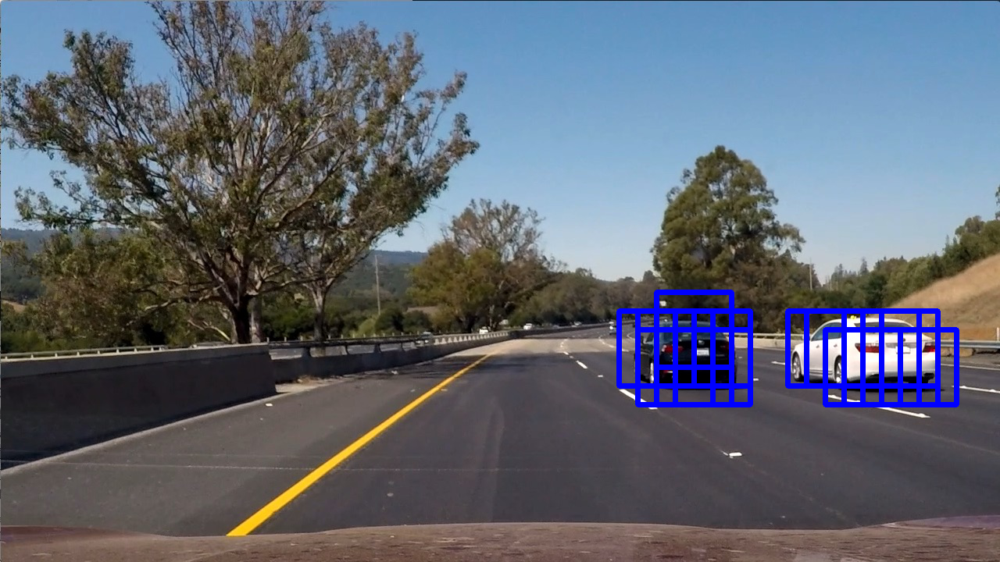](./output_images/find_cars_test4.png "SlidingWindowTest")

### 2. Show some examples of test images to demonstrate how your pipeline is working.  What did you do to optimize the performance of your classifier?

After using all the techniques mentioned above and shown in the notebook, I used the search window to predict car presence using techniques shown in lecture like heatmaps and thresholding.  Here are some example images:

---

## Video Implementation

### 1. Provide a link to your final video output.  Your pipeline should perform reasonably well on the entire project video (somewhat wobbly or unstable bounding boxes are ok as long as you are identifying the vehicles most of the time with minimal false positives.)

Click the screenshot below to navigate to my final video output.
[](https://youtu.be/m5R33ddrpgY "Project Output")

### 2. Describe how (and identify where in your code) you implemented some kind of filter for false positives and some method for combining overlapping bounding boxes.

I recorded the positions of positive detections in each frame of the video.  From the positive detections I created a heatmap and then thresholded that map to identify vehicle positions.  I then used `scipy.ndimage.measurements.label()` to identify individual blobs in the heatmap.  I then assumed each blob corresponded to a vehicle.  I constructed bounding boxes to cover the area of each blob detected. The **Pipeline()** method implements this. As seen here, a moving average was used over the last few frames. This averaging and thresholding removed false positives as can also be seen in the video.

Here's an example result showing the heatmap from a series of frames of video and the result of `scipy.ndimage.measurements.label()`:

#### Here are six frames and their corresponding heatmaps:

Pipeline test | Heatmap
--- | --- 
[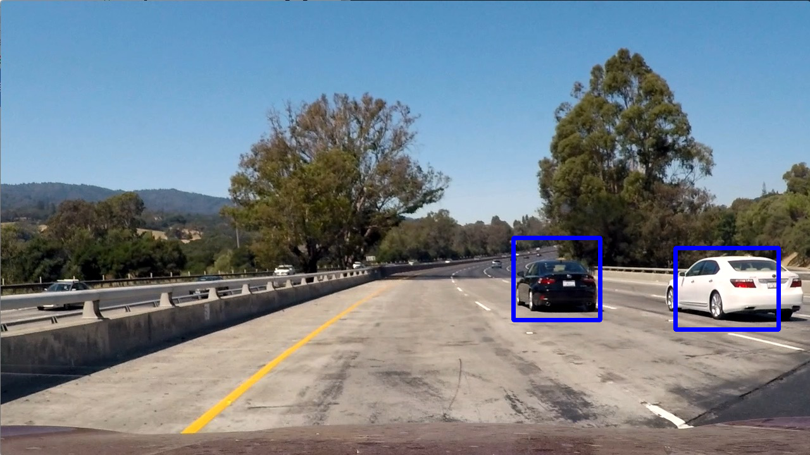](./output_images/pipelineTest1.png "Pipeline test") | [](./output_images/heatmap1.png "Heatmap")
[](./output_images/pipelineTest2.png "Pipeline test") | [](./output_images/heatmap2.png "Heatmap")
[](./output_images/pipelineTest3.png "Pipeline test") | [](./output_images/heatmap3.png "Heatmap")
[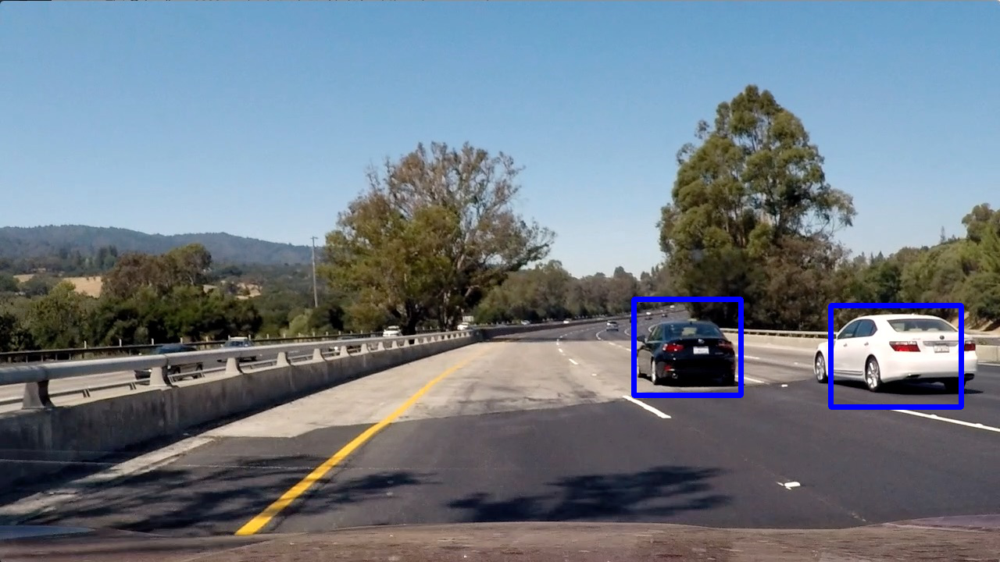](./output_images/pipelineTest4.png "Pipeline test") | [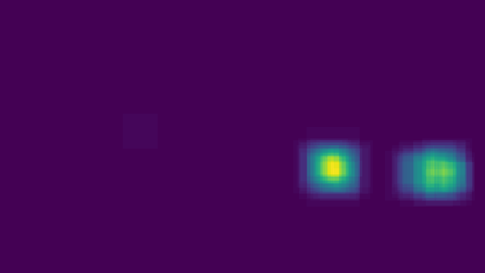](./output_images/heatmap4.png "Heatmap")
[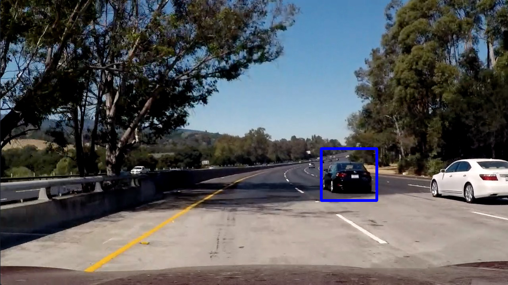](./output_images/pipelineTest5.png "Pipeline test") | [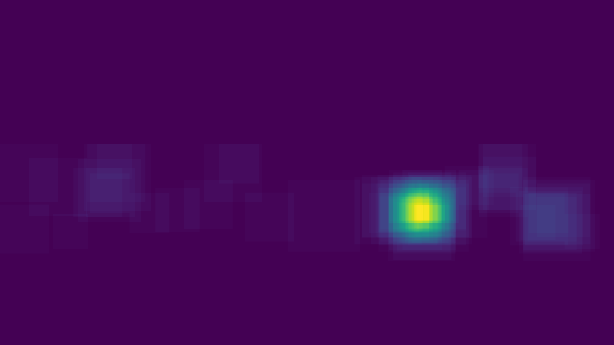](./output_images/heatmap5.png "Heatmap")
[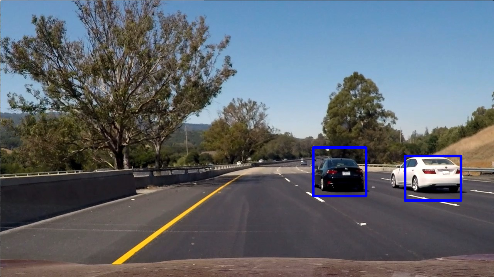](./output_images/pipelineTest6.png "Pipeline test") | [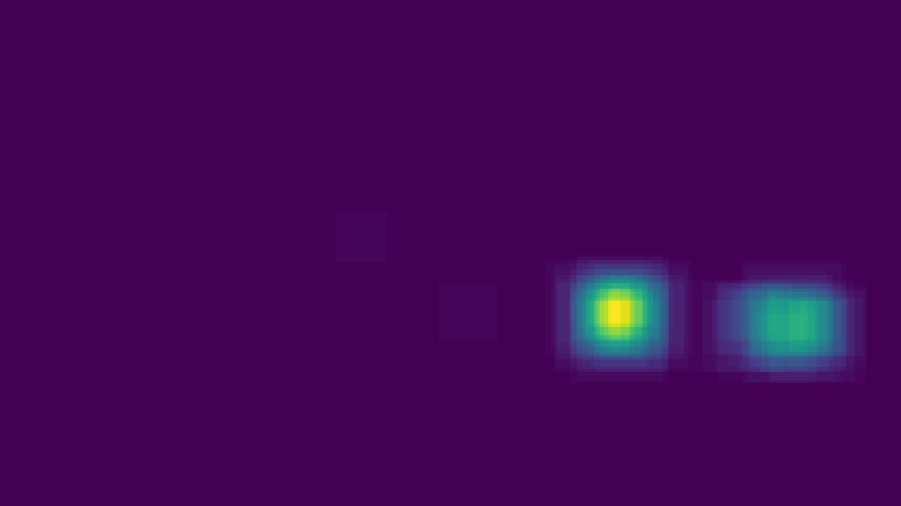](./output_images/heatmap6.png "Heatmap")

---

### Discussion

#### 1. Briefly discuss any problems / issues you faced in your implementation of this project.  Where will your pipeline likely fail?  What could you do to make it more robust?

The techniques used were primarily followed directly from lecture project videos. However following are some comments:
1. Current technique is very slow. Rendering the pipeline to a video takes huge amount of time. There should be an advanced method that does this quicker.
2. Changes light scenarios and noise can affect this pipeline.
3. Updating certain detection parameters may affect the size of the identified object leading to accurate detections.